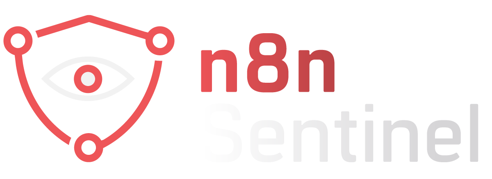
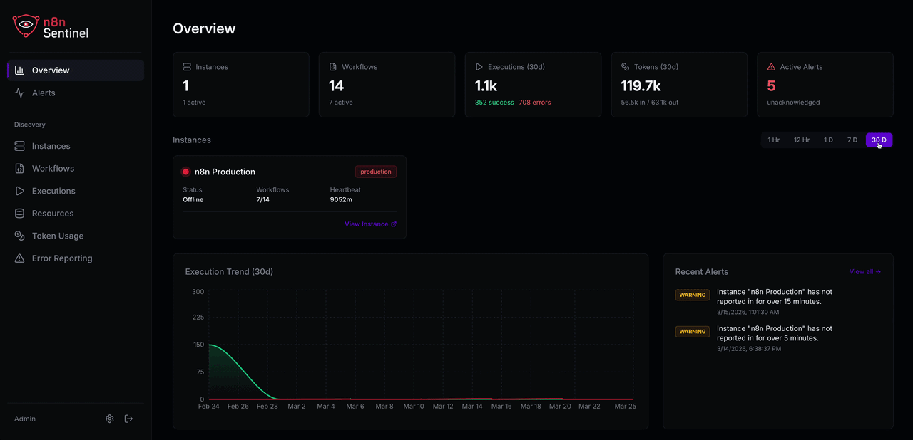
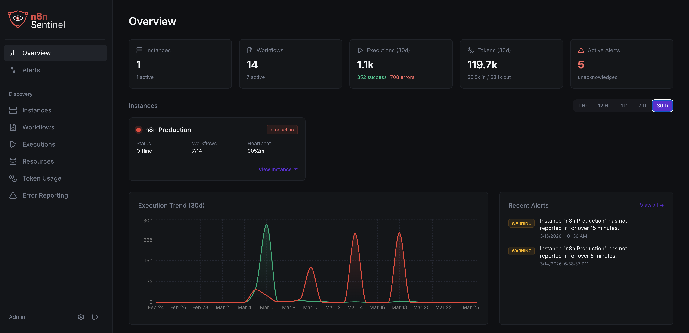
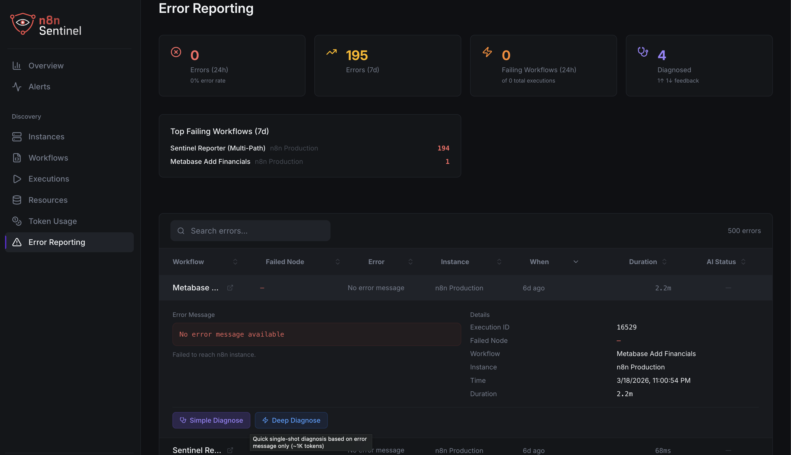
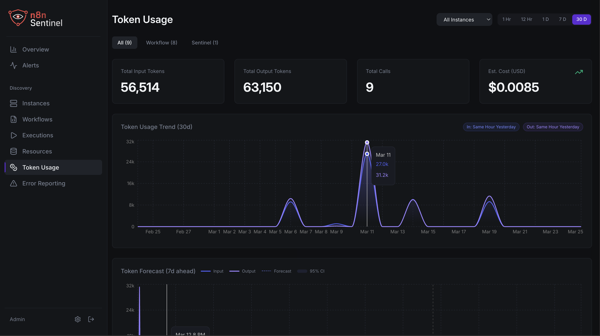
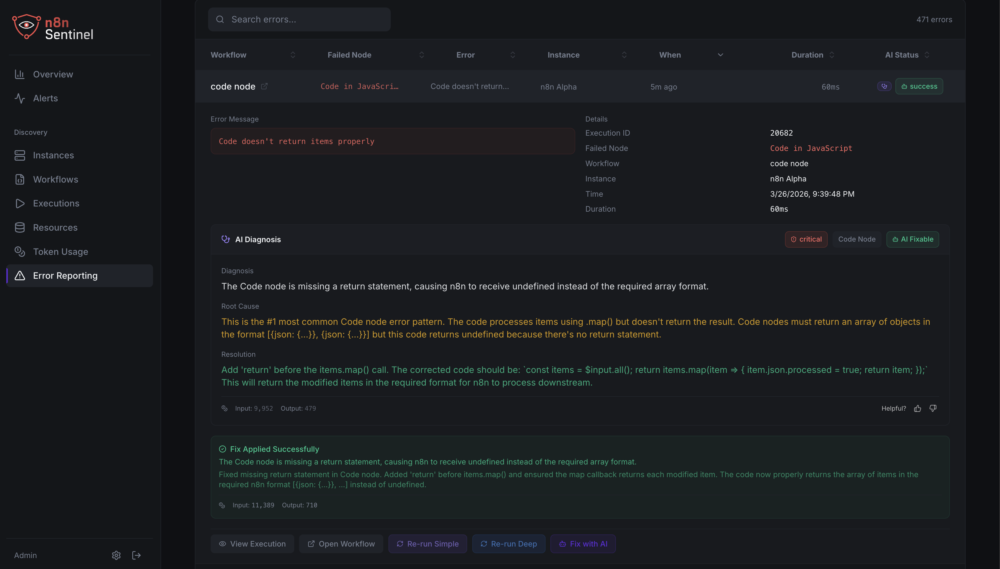
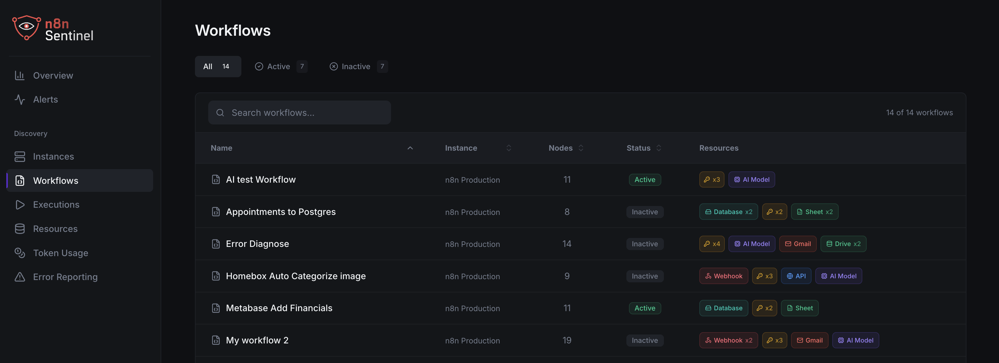
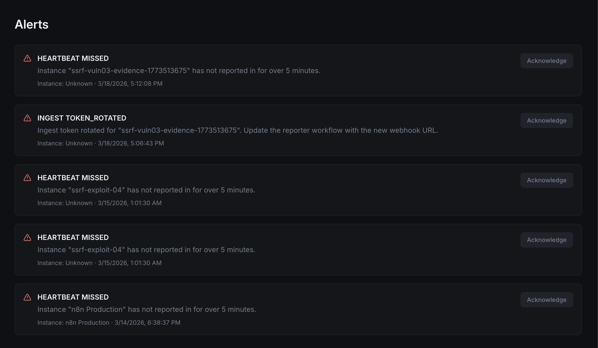
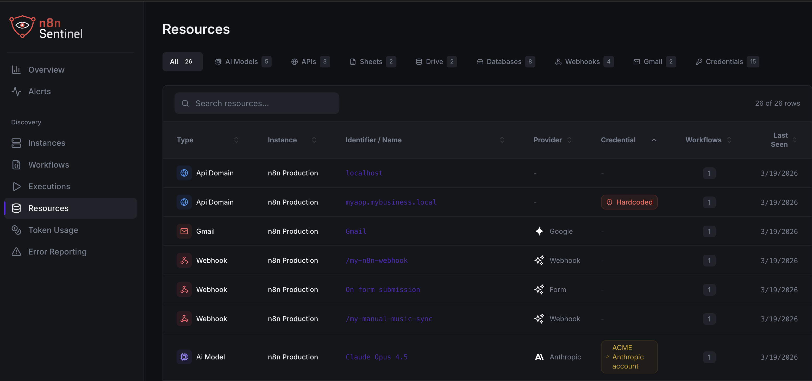

<p align="center">
  <a href="https://github.com/TPGLLC-US/n8n-sentinel">
    
  </a>
</p>

<p align="center">
  <b>Observability for n8n — know what your workflows are doing before your clients do.</b>
</p>

<p align="center">
  <a href="https://github.com/TPGLLC-US/n8n-sentinel/blob/main/LICENSE"></a>
  <a href="https://github.com/TPGLLC-US/n8n-sentinel/stargazers"></a>
  <a href="https://github.com/TPGLLC-US/n8n-sentinel/issues"></a>
  <a href="https://hub.docker.com/r/tpgllc/n8n-sentinel"></a>
  <a href="https://github.com/TPGLLC-US/n8n-sentinel/releases"></a>
</p>

<p align="center">
  <a href="#quick-start">Quick Start</a> •
  <a href="#features">Features</a> •
  <a href="#how-it-works">How It Works</a> •
  <a href="#screenshots">Screenshots</a> •
  <a href="#philosophy">Philosophy</a> •
  <a href="https://sentinel.realsimplesolutions.com/docs">Docs</a> •
  <a href="#contributing">Contributing</a>
</p>

---

## What is n8n Sentinel?

n8n Sentinel is a self-hosted observability platform purpose-built for [n8n](https://n8n.io) workflow automation. It monitors your n8n instances, tracks workflow executions, surfaces errors with AI-powered diagnosis, and gives you a single dashboard to understand what's happening across all your automation infrastructure.

If you run n8n in production — for clients, for your team, or for yourself — and you've ever been surprised by a silently failing workflow, Sentinel exists so that never happens again.

<p align="center">
  
</p>

## Quick Start

Sentinel deploys alongside your n8n instance(s) via Docker Compose. You'll be looking at your dashboard in under 2 minutes.

**Prerequisites:** Docker and Docker Compose installed on your server.

```bash
# Clone the repository
git clone https://github.com/TPGLLC-US/n8n-sentinel.git
cd n8n-sentinel

# Copy the example environment file and configure
cp .env.example .env

# Start Sentinel
docker compose up -d
```

Open `http://localhost:3000` in your browser. Create your admin account, register your first n8n instance, and install the Reporter workflow (downloadable from the dashboard) on your n8n instance to start sending data.

> **That's it.** No external dependencies, no third-party accounts, no API keys required for core functionality. AI-powered diagnosis requires your own Anthropic API key, configured in Settings.

## Features

### Monitoring & Visibility
- **Multi-Instance Dashboard** — Monitor one or many n8n instances from a single pane of glass with execution stats, success/failure rates, and health status
- **Workflow Browser** — Cross-instance workflow listing with filtering and search
- **Execution Explorer** — Filterable execution history by instance, workflow, status, and date range
- **Heartbeat Detection** — Automatic alerting when an n8n instance goes silent
- **Error Reporting** — Centralized error tracking with stats, detail views, and historical trends

### AI-Powered Diagnosis
- **AI Error Diagnosis** — One-click Claude-powered analysis of workflow failures with root cause identification and fix suggestions (bring your own Anthropic API key)
- **Deep Agentic Diagnosis** — Multi-turn AI investigation that iteratively analyzes complex failures using tool-use loops for deeper root cause analysis
- **AI Auto-Fix** — Agentic multi-turn workflow repair that inspects specific nodes, validates changes, and applies targeted fixes directly to your n8n instance
- **Error Enrichment** — Automatic backfill of missing error details from the n8n API for richer diagnosis context
- **Diagnosis Feedback** — Thumbs up/down tracking on AI diagnoses to improve quality over time

### Resource Intelligence
- **AI Resource Inventory** — Track which AI models, APIs, and external services your workflows depend on across all instances
- **Token Usage Analytics** — Recharts-powered dashboards showing AI token consumption, cost forecasting, and provider breakdown
- **Models.dev Integration** — Automatic model catalog enrichment with provider logos and metadata

### Alerts & Notifications
- **Alert Rules** — Configurable threshold-based alerts for execution failures, workflow errors, and instance heartbeat gaps
- **Alert Management** — View, acknowledge, and track alert history

### Data & Infrastructure
- **HMAC-Signed Ingestion** — Cryptographically authenticated data pipeline between your n8n Reporter workflow and Sentinel
- **Encryption at Rest** — All sensitive configuration (API keys, credentials) encrypted in the database
- **Data Retention Management** — Configurable retention windows (10–90 days) with automatic daily aggregation before cleanup
- **R2/S3 Backup** — Schedule automated backups to Cloudflare R2 or any S3-compatible storage
- **GitHub Workflow Versioning** — Automatic workflow snapshot commits to a Git repository for version history and audit trails
- **Docker Compose Deployment** — Single `docker compose up` with Sentinel + Postgres, ready for production
- **Health Endpoint** — `/health` with database connectivity check for your own monitoring stack

## How It Works

```
┌──────────────┐     ┌──────────────┐     ┌──────────────┐
│  n8n          │     │  n8n          │     │  n8n          │
│  Instance A   │     │  Instance B   │     │  Instance C   │
└──────┬───────┘     └──────┬───────┘     └──────┬───────┘
       │                    │                    │
       │  Reporter Workflow (HMAC-signed webhooks)
       │                    │                    │
       └────────────┬───────┴────────────────────┘
                    │
                    ▼
          ┌─────────────────┐
          │  n8n Sentinel    │
          │  ┌─────────────┐ │
          │  │ Ingestion    │ │
          │  │ Engine       │ │
          │  └──────┬──────┘ │
          │         │        │
          │  ┌──────▼──────┐ │
          │  │ PostgreSQL   │ │
          │  │ + Aggregation│ │
          │  └──────┬──────┘ │
          │         │        │
          │  ┌──────▼──────┐ │
          │  │ Dashboard    │ │
          │  │ + AI Diag.   │ │
          │  └─────────────┘ │
          └─────────────────┘
```

1. **Reporter Workflow** — A lightweight n8n workflow (downloadable from Sentinel's dashboard) that runs on each monitored n8n instance. It collects execution data and sends it to Sentinel via HMAC-signed webhooks on a schedule.

2. **Ingestion Engine** — Validates HMAC signatures, normalizes incoming data, detects baselines, and writes to PostgreSQL. Runs heartbeat checks against registered instances.

3. **Dashboard & AI** — React frontend with real-time views into executions, errors, workflows, and resources. AI diagnosis calls Anthropic's Claude API using your own API key — Sentinel never phones home or proxies your data through third-party services.

## Screenshots

<!-- Replace these paths with your actual screenshot files -->

| Dashboard Overview | Error Diagnosis | Token Analytics |
|:---:|:---:|:---:|
|  |  |  |

| Fix with AI | Workflow Browser | Alerts |
|:---:|:---:|:---:|
|  |  |  |

| Resource Inventory | | |
|:---:|:---:|:---:|
|  | | |

## Philosophy

n8n Sentinel is **free and open source with no features behind a paywall.**

Every feature listed above ships in the open-source version. There is no "Community Edition" with capabilities stripped out. If you can self-host it, you get everything.

We believe observability is not a luxury feature — if you're running workflows that matter, you deserve full visibility into them regardless of your budget.

**How we sustain this:**

- **n8n Sentinel Cloud** (coming soon) — a managed, hosted version of Sentinel for teams that don't want to deal with servers, backups, and upgrades. Same features, zero ops. The Cloud version will include managed email reports and alert notifications delivered via our infrastructure — the only capabilities that require us to operate services on your behalf.

- **Community Donations** — If Sentinel saves you from a silent workflow failure at 2 AM, consider [sponsoring the project](https://github.com/sponsors/TPGLLC-US).

This model is inspired by [Coolify](https://coolify.io/philosophy), [Plausible](https://plausible.io), and [Cal.com](https://cal.com) — projects that prove great open-source software and sustainable businesses aren't mutually exclusive.

## Configuration

### Environment Variables

| Variable | Required | Default | Description |
|---|:---:|---|---|
| `DATABASE_URL` | ✅ | — | PostgreSQL connection string |
| `JWT_SECRET` | ✅ | — | Secret key for JWT authentication |
| `HMAC_SECRET` | ✅ | — | Shared secret for Reporter workflow signature verification |
| `ENCRYPTION_KEY` | ✅ | — | 32-byte key for encrypting sensitive settings at rest |
| `PORT` | — | `3000` | Port the Sentinel server listens on |
| `ANTHROPIC_API_KEY` | — | — | Your Anthropic API key for AI diagnosis (configurable in Settings UI) |

See [`.env.example`](.env.example) for a complete reference with comments.

## Deployment

### Docker Compose (Recommended)

The default `docker-compose.yml` includes Sentinel and PostgreSQL:

```bash
docker compose up -d
```

### Behind a Reverse Proxy

Sentinel works behind Nginx, Caddy, Traefik, or Coolify. Point your reverse proxy at `localhost:3000` or the port you set in the `.env` file and configure your SSL termination as usual.

### Updating

```bash
git pull
docker compose pull
docker compose up -d
```

## Roadmap

We build in public. See our [GitHub Issues](https://github.com/TPGLLC-US/n8n-sentinel/issues) for what's planned and in progress. Key areas of focus:
- [X] Auto Fix Issues with AI
- [ ] Webhook notification channels (Slack, Discord, generic webhook) for CE alert delivery
- [ ] Grafana-compatible metrics export
- [ ] Multi-user teams with role-based access
- [ ] Public API for programmatic access to Sentinel data

Have an idea? [Open an issue](https://github.com/TPGLLC-US/n8n-sentinel/issues/new) — we read every one.

## Contributing

We welcome contributions! Whether it's a bug fix, a new feature, documentation improvement, or just a typo — every PR matters.

1. Fork the repository
2. Create your feature branch: `git checkout -b feature/my-feature`
3. Commit your changes: `git commit -m 'feat: add my feature'`
4. Push to the branch: `git push origin feature/my-feature`
5. Open a Pull Request against `main`

**Please note:** By contributing, you agree to the [Contributor License Agreement (CLA)](CLA.md), which allows us to include your contributions in both the open-source and Cloud versions of Sentinel. Your code remains AGPL-3.0 licensed in the open-source repository — the CLA simply grants us the rights needed to operate the managed Cloud service.

For detailed setup instructions, architecture overview, and coding conventions, see [CONTRIBUTING.md](CONTRIBUTING.md).

## Tech Stack

- **Frontend:** React, Recharts, Tailwind CSS
- **Backend:** Node.js, Express, TypeScript
- **Database:** PostgreSQL
- **AI:** Anthropic Claude API (BYOK — bring your own key)
- **Infrastructure:** Docker, Docker Compose
- **Ingestion Auth:** HMAC-SHA256 signed webhooks

## Community

- [GitHub Discussions](https://github.com/TPGLLC-US/n8n-sentinel/discussions) — Questions, ideas, show & tell
- [GitHub Issues](https://github.com/TPGLLC-US/n8n-sentinel/issues) — Bug reports and feature requests
<!-- Uncomment when ready:
- [Discord](https://discord.gg/your-invite) — Real-time chat with the community
-->

## License

n8n Sentinel is licensed under the [GNU Affero General Public License v3.0 (AGPL-3.0)](LICENSE).

You are free to use, modify, and self-host Sentinel. If you modify the source and make it available over a network, you must share your modifications under the same license.

For commercial licensing inquiries, contact [joe@realsimplesolutions.com](mailto:n8n-sentinel@realsimplesolutions.ai).

---

<p align="center">
  Built by <a href="https://realsimplesolutions.ai">Real Simple Solutions</a><br />
  If Sentinel helps you sleep better at night, <a href="https://github.com/sponsors/TPGLLC-US">sponsor the project</a> ⭐
</p>
